# Sơ đồ Kiến trúc & Luồng Nghiệp vụ — POS Khamphouvong

> Tài liệu trực quan hoá kiến trúc hệ thống và các luồng nghiệp vụ chính, dùng sơ đồ **Mermaid** (render trực tiếp trên GitHub và VSCode — cài extension _Markdown Preview Mermaid Support_ nếu cần).
> Các sơ đồ được dựng từ **mã nguồn thực tế** (entities, EF configurations, handlers), không phải mô tả lý thuyết.

## Mục lục

1. [Kiến trúc triển khai (Deployment)](#1-kiến-trúc-triển-khai-deployment)
2. [Clean Architecture & phân lớp](#2-clean-architecture--phân-lớp)
3. [Vòng đời một request (CQRS pipeline)](#3-vòng-đời-một-request-cqrs-pipeline)
4. [Bản đồ module nghiệp vụ](#4-bản-đồ-module-nghiệp-vụ)
5. [ERD — Tổ chức & Phân quyền](#5-erd--tổ-chức--phân-quyền)
6. [ERD — Sản phẩm, Định giá & Kho](#6-erd--sản-phẩm-định-giá--kho)
7. [ERD — Giao dịch & Quỹ](#7-erd--giao-dịch--quỹ)
8. [Luồng xác thực JWT](#8-luồng-xác-thực-jwt)
9. [Máy trạng thái giao dịch](#9-máy-trạng-thái-giao-dịch)
10. [Luồng bán hàng POS & tác động tồn kho](#10-luồng-bán-hàng-pos--tác-động-tồn-kho)
11. [Kho — Nhập kho và Xuất kho](#11-kho--nhập-kho-và-xuất-kho)
12. [Các loại giao dịch](#12-các-loại-giao-dịch)
13. [Luồng Thu đổi / Trade](#13-luồng-thu-đổi--trade)
14. [Chuỗi thiết lập định giá (Vàng / Bạc / Đá)](#14-chuỗi-thiết-lập-định-giá-vàng--bạc--đá)
15. [Luồng sổ quỹ tiền mặt hàng ngày](#15-luồng-sổ-quỹ-tiền-mặt-hàng-ngày)
16. [Ghi chú độ chính xác](#16-ghi-chú-độ-chính-xác)

---

## 1. Kiến trúc triển khai (Deployment)

Mô hình **Modular Monolith**: Client → Nginx → Frontend SPA + Backend API → PostgreSQL.

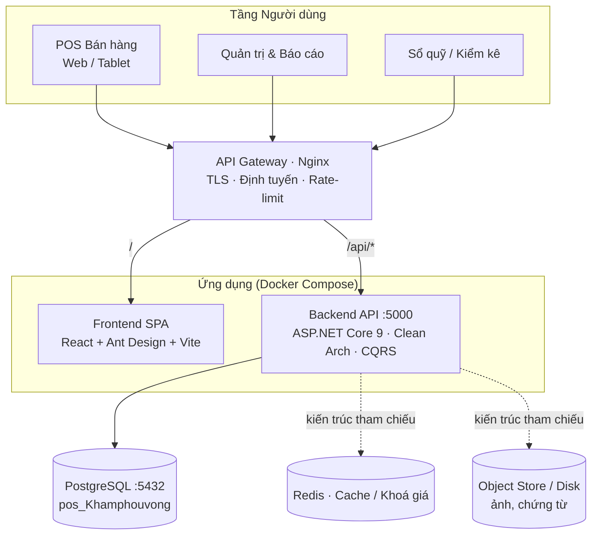

> **Lưu ý:** `docker-compose.yml` hiện tại gồm **postgres + backend + frontend + nginx**. Redis và Object Store nằm trong kiến trúc tham chiếu nhưng **chưa được triển khai** trong compose hiện tại (vẽ nét đứt).

---

## 2. Clean Architecture & phân lớp

Phụ thuộc một chiều: `API → Application → Domain`, `Infrastructure → Application/Domain`. API là composition root (đăng ký DI).

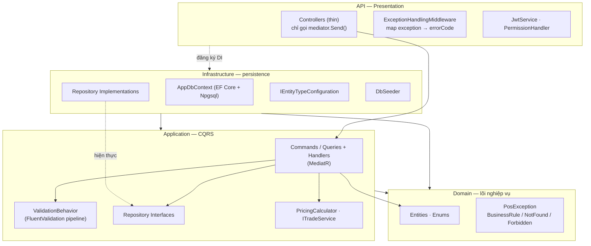

| Lớp                | Trách nhiệm                                        | Không được phép                            |
| ------------------ | -------------------------------------------------- | ------------------------------------------ |
| **Domain**         | Entities, Enums, Exceptions — thuần nghiệp vụ      | Phụ thuộc lớp khác                         |
| **Application**    | CQRS handlers, repository **interfaces**, services | Inject `AppDbContext`                      |
| **Infrastructure** | EF Core, repository **implementations**, seeder    | —                                          |
| **API**            | Controllers mỏng, middleware, JWT, DI              | Đặt business logic / inject `AppDbContext` |

---

## 3. Vòng đời một request (CQRS pipeline)

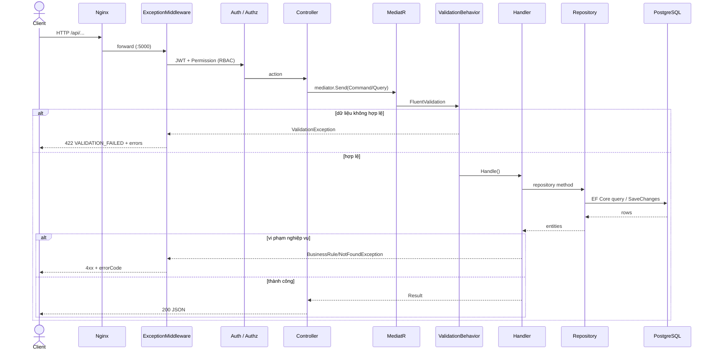

Thứ tự ưu tiên map lỗi trong `ExceptionHandlingMiddleware`:
`ValidationException` → 422 · `PosException` (dùng `StatusCode`/`ErrorCode`) · `UnauthorizedAccessException` → 403 · còn lại → 500 `SYSTEM_INTERNAL_ERROR`.

---

## 4. Bản đồ module nghiệp vụ

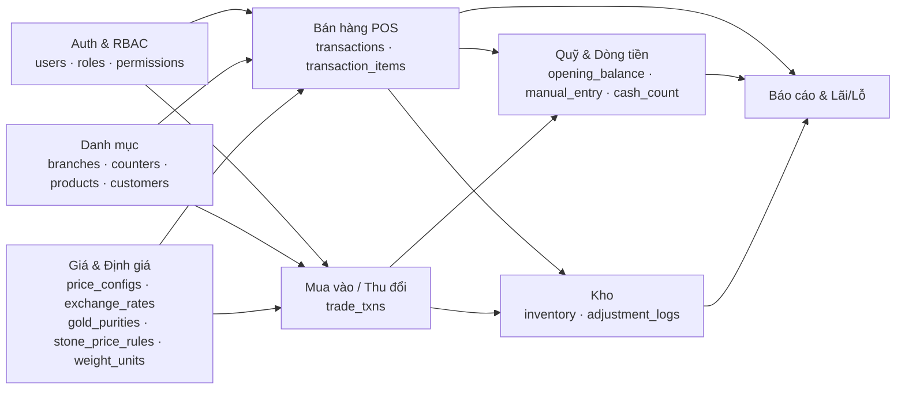

---

## 5. ERD — Tổ chức & Phân quyền

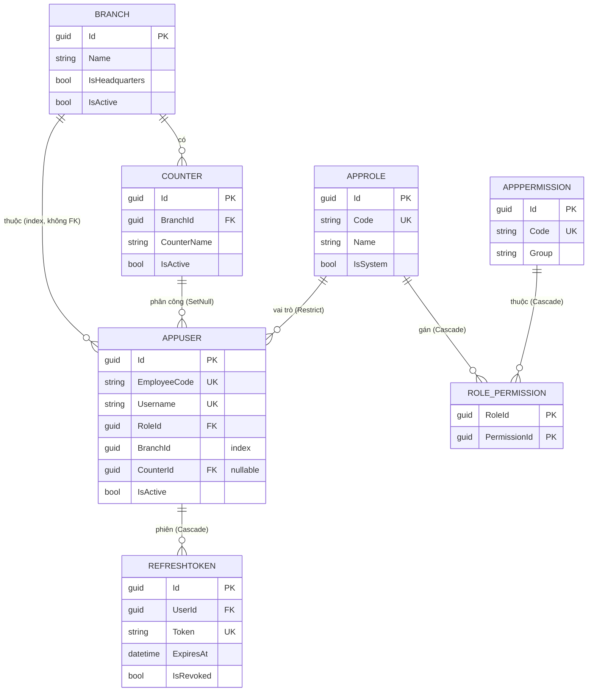

---

## 6. ERD — Sản phẩm, Định giá & Kho

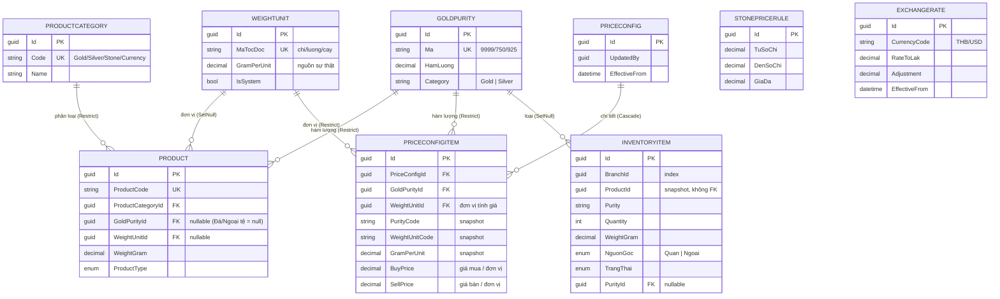

> `STONEPRICERULE` và `EXCHANGERATE` là bảng cấu hình độc lập (không FK), nên đứng riêng.

---

## 7. ERD — Giao dịch & Quỹ

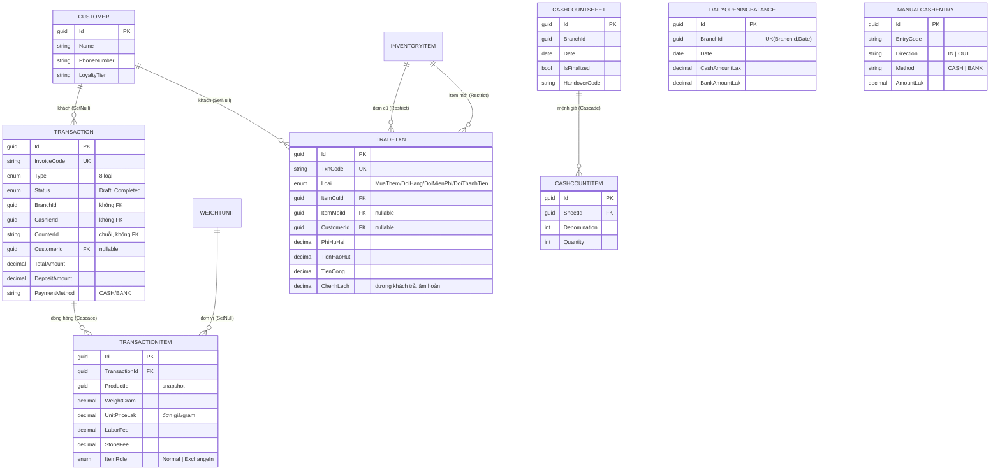

---

## 8. Luồng xác thực JWT

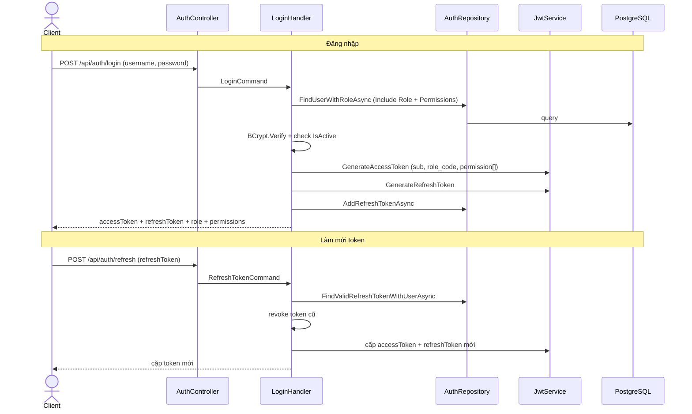

- Access token chứa claim: `sub` (userId), `unique_name`, `role_code`, và nhiều claim `permission`.
- `PermissionHandler` kiểm tra claim `permission` khớp policy `[Authorize(Policy = ...)]` trên từng endpoint.

---

## 9. Máy trạng thái giao dịch

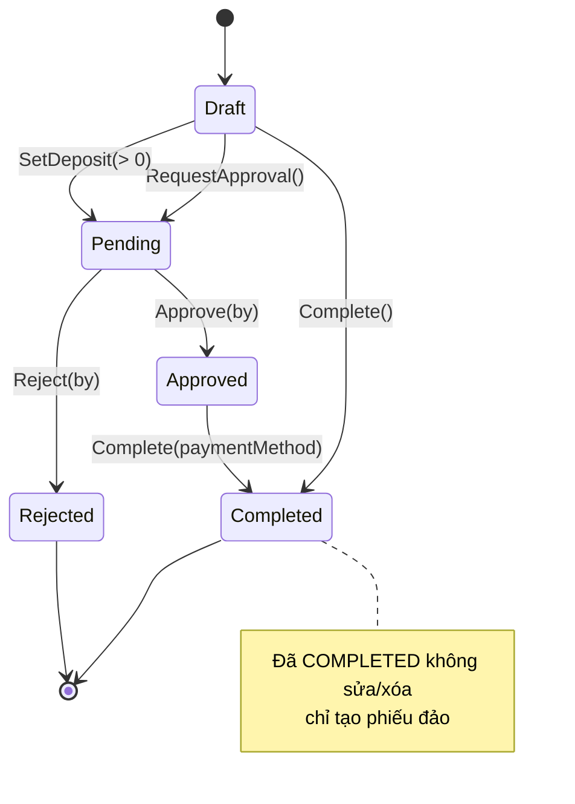

> **Quan trọng:** tồn kho được áp dụng **ngay khi tạo giao dịch** (`ApplyInventoryChangesAsync`), không phải lúc duyệt/hoàn tất. Duyệt/từ chối **không** đảo ngược tồn kho.

---

## 10. Luồng bán hàng POS & tác động tồn kho

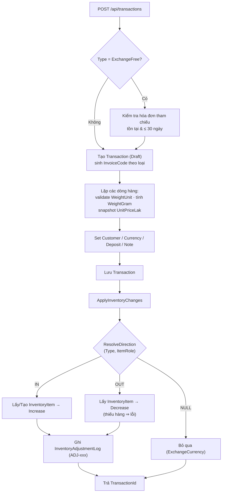

**Ma trận chiều tồn kho** (`ResolveInventoryDirection`):

| Loại giao dịch              | ItemRole   | Tồn kho    |
| --------------------------- | ---------- | ---------- |
| SellGold / SellSilver       | Normal     | **OUT**    |
| ExchangeGold / ExchangeFree | Normal     | **OUT**    |
| BuyGold / BuyMoreGold       | bất kỳ     | **IN**     |
| ExchangeGold / ExchangeFree | ExchangeIn | **IN**     |
| ExchangeToMoney             | bất kỳ     | **IN**     |
| ExchangeCurrency            | —          | **bỏ qua** |

> Công thức tổng: `TotalAmount = SubtotalAmount − ExchangeCredit + LaborFee + StoneFee`. `LineTotal` mỗi dòng = `WeightGram × UnitPriceLak`. `DepositAmount > 0` tự chuyển Draft → Pending.

---

## 11. Kho — Nhập kho và Xuất kho

Tồn kho (`inventory_items`) biến động qua **hai đường**, cả hai đều cộng/trừ `Quantity` + `WeightGram` của `InventoryItem` và ghi một bản ghi `InventoryAdjustmentLog` (`ADJ-xxx`):

| Đường        | Kích hoạt                                                    | Chiều                                           | Tham chiếu   |
| ------------ | ------------------------------------------------------------ | ----------------------------------------------- | ------------ |
| **Tự động**  | Giao dịch POS / Thu đổi (`ApplyInventoryChangesAsync`)       | IN/OUT theo ma trận `ResolveInventoryDirection` | Mục 10       |
| **Thủ công** | `POST /api/inventory/{id}/adjust` (policy `InventoryManage`) | `IN` = **nhập kho** · `OUT` = **xuất kho**      | (sơ đồ dưới) |

### 11.1. Luồng điều chỉnh thủ công (`AdjustInventoryCommandHandler`)

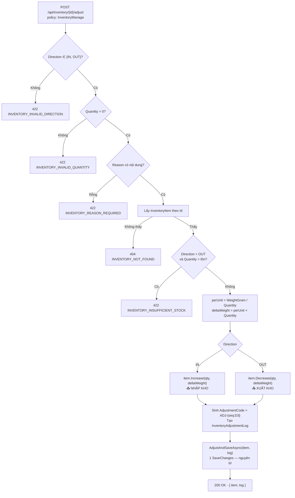

**Quy ước:**

- `deltaWeight` suy ra từ **trọng lượng bình quân mỗi đơn vị** (`WeightGram / Quantity`), không nhập tay → giữ nhất quán tổng trọng lượng.
- `AdjustmentCode = ADJ-{seq:D3}` với `seq` = số log hiện có + 1.
- `InventoryItem.Decrease` tự ném lỗi khi vượt tồn; handler kiểm tra trước để trả `INVENTORY_INSUFFICIENT_STOCK` (422) đúng chuẩn errorCode.
- `AdjustAndSaveAsync(item, log)` ghi **item + log trong một `SaveChanges`** (nguyên tử).

### 11.2. Vòng đời trạng thái mục kho (`ItemTrangThai`)

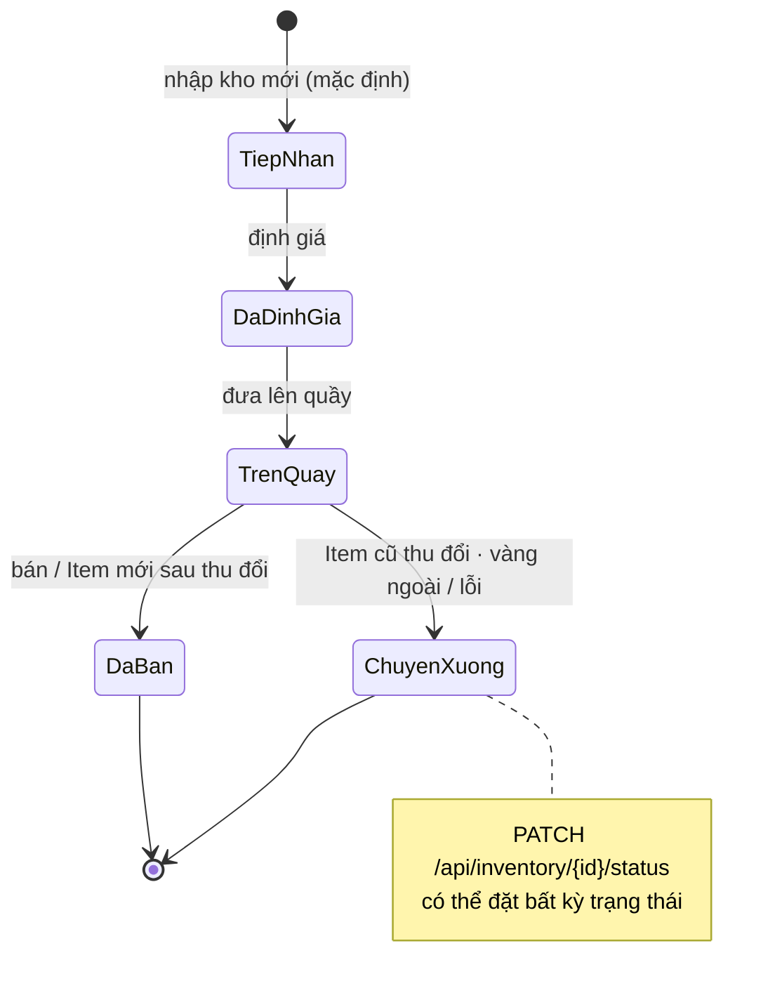

| `ItemTrangThai`   | Ý nghĩa                                                     |
| ----------------- | ----------------------------------------------------------- |
| `TiepNhan` (1)    | Vừa tiếp nhận, chưa định giá (mặc định khi nhập)            |
| `DaDinhGia` (2)   | Đã định giá                                                 |
| `TrenQuay` (3)    | Đang trưng bày, có thể bán                                  |
| `ChuyenXuong` (4) | Chuyển xuống xưởng (vàng ngoài / lỗi / item cũ sau thu đổi) |
| `DaBan` (5)       | Đã bán ra                                                   |

**Nguồn gốc hàng** (`ItemNguonGoc`): `Quan` = vàng của quán (được mua thêm / đổi hàng / đổi miễn phí) · `Ngoai` = vàng ngoài (chỉ mua vào, chuyển xuống xưởng).

### 11.3. Các endpoint Kho

| Method | Route                        | Mục đích                                                                           |
| ------ | ---------------------------- | ---------------------------------------------------------------------------------- |
| GET    | `/api/inventory`             | Danh sách tồn — lọc `branchId / category / trayId / status / nguonGoc`; phân trang |
| GET    | `/api/inventory/{id}`        | Chi tiết một mục kho                                                               |
| POST   | `/api/inventory/{id}/adjust` | **Nhập (IN) / Xuất (OUT)** thủ công kèm lý do                                      |
| PATCH  | `/api/inventory/{id}/status` | Đổi `TrangThai`                                                                    |
| GET    | `/api/inventory/adjustments` | Lịch sử điều chỉnh (`ADJ-xxx`)                                                     |

> Ma trận chiều tồn kho **tự động** theo loại giao dịch: xem Mục 10. Cấu trúc bảng `inventory_items`: xem ERD Mục 6. Mã lỗi liên quan: `INVENTORY_INVALID_DIRECTION`, `INVENTORY_INVALID_QUANTITY`, `INVENTORY_REASON_REQUIRED`, `INVENTORY_INSUFFICIENT_STOCK`, `INVENTORY_NOT_FOUND`, `INVENTORY_INVALID_STATUS`.

---

## 12. Các loại giao dịch

Hệ thống có **hai luồng song song**: `Transaction` (bán hàng POS) và `TradeTxn` (thu đổi phức tạp).

**`TransactionType`** (bảng `transactions`):

| Enum               | Tiền tố mã | Ý nghĩa                                 |
| ------------------ | ---------- | --------------------------------------- |
| `SellGold`         | BV         | Bán vàng cho khách                      |
| `SellSilver`       | BB         | Bán bạc cho khách                       |
| `BuyGold`          | MV         | Mua vàng từ khách                       |
| `BuyMoreGold`      | MT         | Mua thêm (bù cho đơn có sẵn)            |
| `ExchangeGold`     | DV         | Đổi vàng (cũ ↔ mới)                     |
| `ExchangeFree`     | DMF        | Đổi miễn phí (cần tham chiếu ≤ 30 ngày) |
| `ExchangeCurrency` | NT         | Thu đổi ngoại tệ (không đụng kho)       |
| `ExchangeToMoney`  | DTT        | Đổi vàng lấy tiền mặt                   |

**`TradeType`** (bảng `trade_txns`): `MuaThem`, `DoiHang`, `DoiMienPhi`, `DoiThanhTien`.

---

## 13. Luồng Thu đổi / Trade

`CreateTradeCommandHandler` định tuyến theo `TradeType` sang `TradeService`:

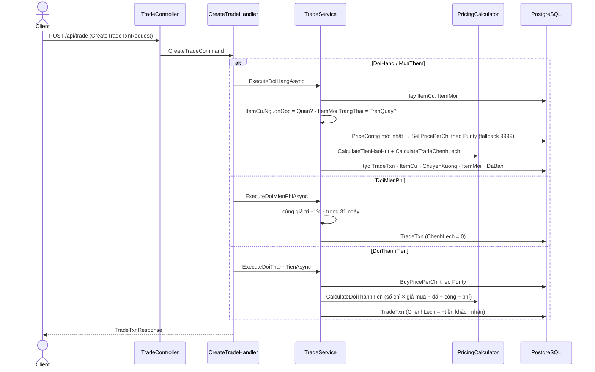

Công thức chênh lệch (đổi hàng):

```
ChenhLech = [ WeightMới/3.75 × giáBán/Chỉ + TiềnĐáMới + TiềnCông + PhíHưHại + TiềnHaoHụt ]
          −  [ WeightCũ/3.75 × giáBán/Chỉ ]
```

`ChenhLech > 0` → khách trả thêm · `< 0` → cửa hàng hoàn lại.

---

## 14. Chuỗi thiết lập định giá (Vàng / Bạc / Đá)

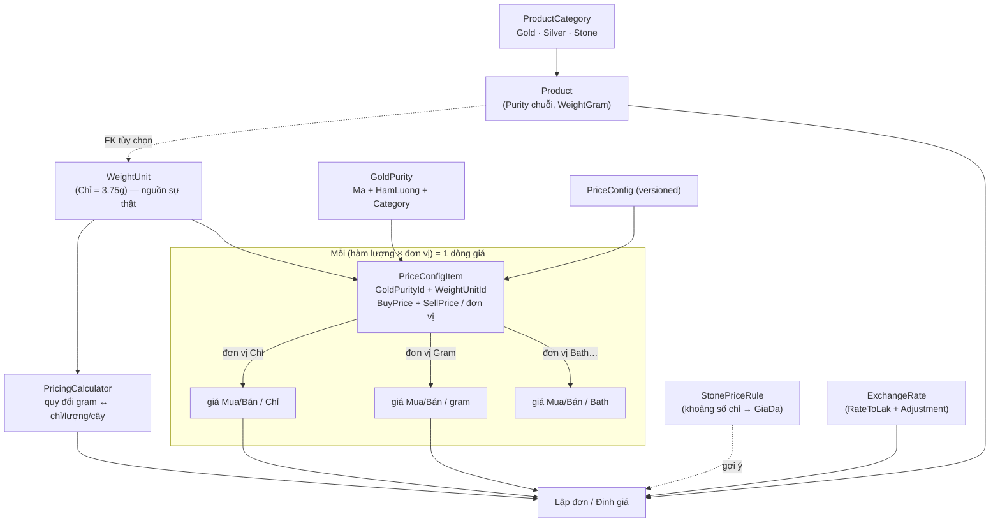

| Nhóm         | Hàm lượng                    | Định giá                                                                                     |
| ------------ | ---------------------------- | -------------------------------------------------------------------------------------------- |
| **Vàng**     | `GoldPurity` Category=Gold   | `PriceConfigItem` — giá/**Chỉ**                                                              |
| **Bạc**      | `GoldPurity` Category=Silver | `PriceConfigItem` — giá/**gram**                                                             |
| **Đá**       | ❌ không có hàm lượng        | **Nhập giá tay** khi bán (`StoneFee` / đơn giá); `StonePriceRule` chỉ gợi ý theo số chỉ vàng |
| **Ngoại tệ** | —                            | `ExchangeRate`: `số tiền × (RateToLak + Adjustment)`                                         |

> Mỗi lần cập nhật giá tạo **bản ghi `PriceConfig` mới** (không ghi đè) → giữ lịch sử. `PriceConfigItem` snapshot `PurityCode/Category/HamLuong` để hiển thị không cần JOIN và bất biến theo thời điểm.

---

## 15. Luồng sổ quỹ tiền mặt hàng ngày

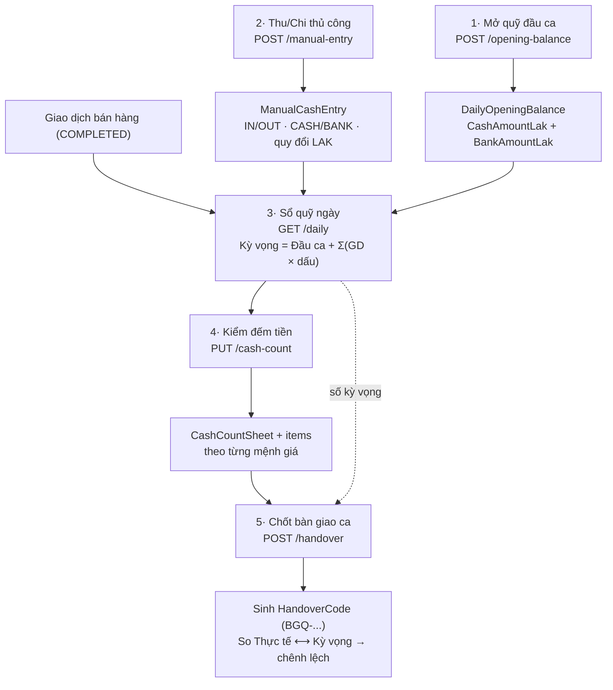

Quy ước dấu khi tính quỹ kỳ vọng: bán hàng `+`, mua vào / đổi ngoại tệ `−`; thu/chi thủ công theo `Direction` (IN `+`, OUT `−`); tách riêng theo `Method` (CASH / BANK).

---

## 16. Ghi chú độ chính xác

Những điểm đã xác minh từ mã nguồn — đáng lưu ý khi đọc sơ đồ:

1. **Tham chiếu lỏng (không FK):** nhiều khoá là `Guid`/`string` phục vụ snapshot & audit chứ **không** ràng buộc FK ở DB:
   - `Transaction.BranchId / CashierId / StaffId`, và `Transaction.CounterId` là **chuỗi** (không FK tới `counters`).
   - `InventoryItem.ProductId / BranchId`, `TradeTxn.BranchId / EmployeeId`, các trường `UpdatedBy / CreatedById` trong cấu hình giá & quỹ.
   - `Product.Purity` là **chuỗi tự do**, không FK tới `GoldPurity` — khớp giá tại thời điểm bán bằng so khớp chuỗi `PurityCode`.
2. **FK thật & hành vi xóa:** `AppUser→AppRole` (Restrict), `AppUser→Counter` (SetNull), `Product→Category` (Restrict), `Product/TransactionItem→WeightUnit` (SetNull), `PriceConfigItem→GoldPurity` (Restrict) & `→PriceConfig` (Cascade), `TradeTxn→InventoryItem` ×2 (Restrict), `role_permissions / refresh_tokens / cash_count_items` (Cascade).
3. **Hai hệ giao dịch:** `Transaction` (POS, 8 `TransactionType`) và `TradeTxn` (4 `TradeType`) là hai luồng riêng biệt.
4. **Snapshot pattern:** `TransactionItem`, `PriceConfigItem`, `InventoryAdjustmentLog` lưu bản sao tên/đơn vị/hàm lượng để bất biến theo lịch sử.
5. **Redis / Object Store:** có trong kiến trúc tham chiếu nhưng **chưa** có trong `docker-compose.yml` hiện tại.
6. **Enum lưu dạng chuỗi** trong DB (`HasConversion<string>`); tiền & trọng lượng dùng `decimal`.

---

_Tài liệu sinh từ rà soát mã nguồn (entities, EF configurations, handlers, services). Khi nghiệp vụ thay đổi, cập nhật lại sơ đồ tương ứng. Xem thêm: `docs/API Reference.md` và `docs/Tài liệu Kiến trúc & Thiết kế POS Khamphouvong.md`._
